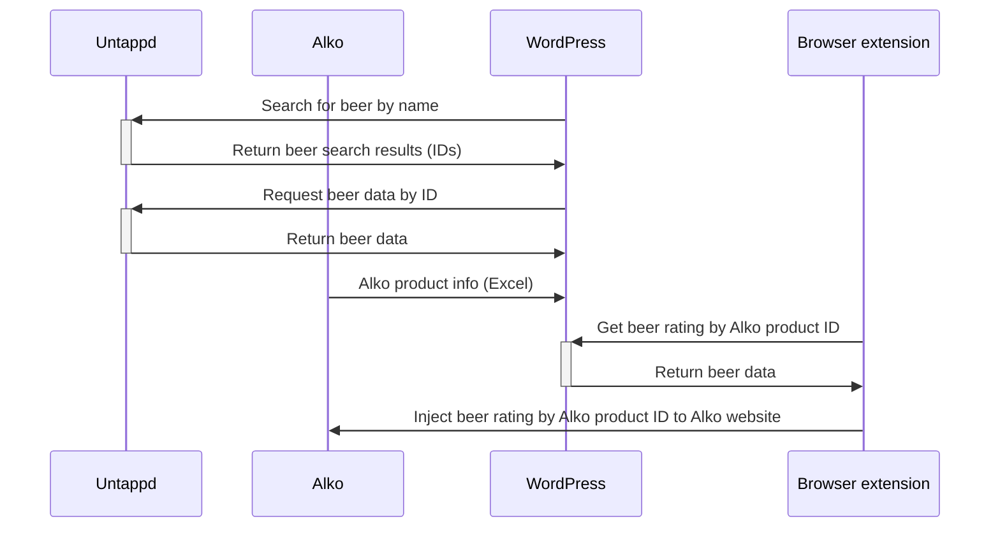

# Untappd Beer Search for WordPress

A WordPress plugin for searching [Untappd](https://untappd.com) for beer info via [Untappd API](https://untappd.com/api/), and saving the information into a WordPress custom post type.

A browser extension for Mozilla Firefox is included. The extension is able to inject the beer ratings to Alko website product catalog.

Contains ability to import [Alko product catalog](https://www.alko.fi/valikoimat-ja-hinnasto/hinnasto) and use it to autocomplete beer search against the Alko catalog.

## Getting started

1. Clone this repository to `wp-content/plugins`.
1. Run `composer install` to install the [Shuchkin\SimpleXLSX](https://github.com/shuchkin/simplexlsx) dependency. It is needed for processing the Alko product catalog (available only in XLSX format).
1. Run `npm install` to install the [jquery.tablesorter](https://mottie.github.io/tablesorter/docs/). It is used to add dynamic column sorting to top beers tables.
1. Activate the plugin.
1. Fill in the plugin settings:
    * Fill in your Untappd API credentials.
    * Fill in your favorite [Alko store ID](https://www.alko.fi/myymalat-palvelut).
    * Fetch the Alko price sheet data for the first time.
1. Start making beer searches against Untappd database in "Search Untappd" plugin page.

## Sequence diagram

## Features, ideas & to-do

- [x] Settings page for Untappd API credentials
- [x] Admin page for search & save
- [x] Custom post type for beers
- [x] Localisation support
- [x] AJAX-based requests without page reload
- [x] Import data from [Alko](https://www.alko.fi/valikoimat-ja-hinnasto/hinnasto) (as CSV) and match the corresponding Untappd beer ID
- [x] Ability to re-fetch beer info to update an existing beer 
- [x] Taxonomies for beer type, ABV, country, brewery etc.
- [x] Browser extension to show ratings on Alko website.
- [x] Sort admin listing by rating
- [ ] Front-end UI, not only on admin side?
- [ ] Beer filter by type, ABV, brewery etc.
- [ ] Search for multiple beers at once (textarea input instead of text)
- [ ] Replace jQuery with native JavaScript
- [x] Process the whole Alko catalog in batches, ~~trying to match beers as automatically as possible, skipping already imported beers~~
- [ ] ~~Remove duplicates from Alko product list (mainly due to same product being sold in different size bottles)~~
- [x] Ability to set favorite Alko store
- [x] Ability to update product availability in favorite Alko store and in alko.fi online webstore
- [x] Top rated beers view (separately for favorite Alko store and online store)
- [x] Ability to associate multiple Alko product numbers per saved beer (same product sold in different size bottles)
